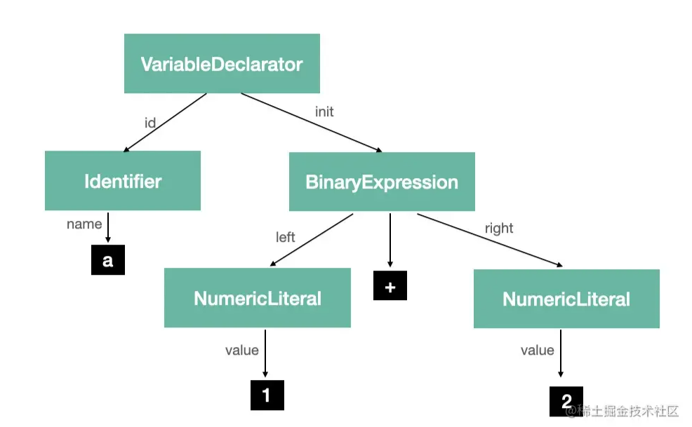

# js 解释器
当 parser 把 源码 parse 成 AST 之后，其实已经能够拿到源码的各部分信息了，比如
```js
const a = 1 + 2;
```
对应的 AST 是这样的

当我们处理到 BinarayExpression 节点，operator 是 +，会做加法运算，取左右两边的值相加。
当我们处理到 NumercLiteral 节点，是数字字面量，直接返回它的值（value）。
当我们处理到 Identifier 节点，是标识符，直接返回名字（name）。
当我们处理到 VariableDeclarator，我们就知道是一个变量声明语句，要在作用域 （scope）中放一个属性，属性名为 id 的值， 属性值为 init 的值。而 id 和 init 可以求出来。
